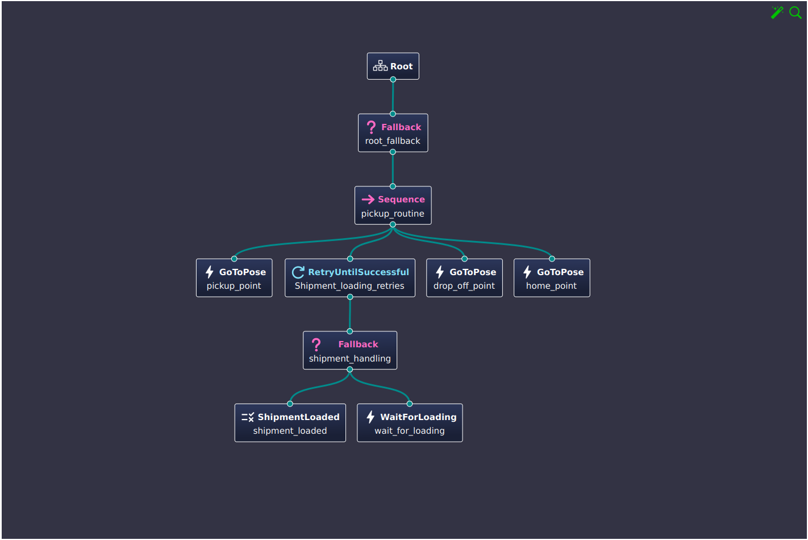

# Simulation of Autonomous Mobile Robot in warehouse using Behavior Trees

## Overview
This project demonstrates an autonomous mobile robot (AMR) navigating within a warehouse environment using a Behavior Tree implementation in C++ and ROS. The simulation uses the TurtleBot3 Gazebo package along with a custom-built warehouse world to showcase:
- Navigation from a home position to a pickup point.
- A simulated cargo-loading process using a random boolean generator.
- Movement to a drop-off point followed by a return to the home position.
- An infinite loop of these tasks to demonstrate continuous operation using Behavior Trees.

## Features
- **Behavior Tree Integration:** Implements decision-making using BehaviorTree.CPP.
- **ROS Integration:** Uses ROS for node communication and control.
- **Custom Gazebo World:** A tailored warehouse environment for realistic simulation.
- **Simulated Cargo Loading:** Random boolean generator determines if cargo is loaded (1) or not (0). In the event of failure, the simulation waits 5 seconds before retrying.

## Requirements
- **This project has been developed for ROS2 Humble**
- **Gazebo Simulator:** I have used Gazebo Classic for this project.
- **TurtleBot3 Packages:** Ensure you have the `turtlebot3_gazebo` package installed and set the default turtlemodel in your environment
- **BehaviorTree.CPP:** Install the BehaviorTree.CPP library.
- **C++:** C++17 or later for proper compilation.

## Installation
1. **Clone the Repository:**
   
   ```bash
   mkdir amr-warehouse-sim
   cd amr-warehouse-sim
   git clone https://github.com/nirmalram07/ros2_bt_demo.git

2. **Build the Packages:**
   
   ```bash
   cd ../
   colcon build --symlink-install
   source install/setup.bash
   
3. **Launching the Nodes:**
   
      ```bash
      source install/setup.bash 
      ros2 launch turtlebot3_gazebo turtlebot3_world.launch.py
      ```
   Now open a new terminal tab to launch the nav2_bringup node
   
      ```bash
      source install/setup.bash
      ros2 launch turtlebot3_spawn turtlebot_gazebo.launch.py
      ```
   Now again open a new terminal to launch the behavior tree node
   
      ```bash
      source install/setup.bash
      ros2 launch bt_turtlebot bt_node.launch.py
      ```

Behavior Tree Structure



The core functionality is driven by a Behavior Tree, which orchestrates the following sequence:

   •Start: The robot initializes at the home position.
   •Navigate to Pickup: The robot moves to the designated pickup point.
   •Cargo Loading Simulation: A random boolean is generated to simulate cargo loading:
        If the result is 1, cargo is considered loaded.
        If the result is 0, the process waits 5 seconds before retrying.
   •Navigate to Drop-off: Once loaded, the robot moves to the drop-off point.
   •Return Home: The robot then returns to the home position.
   •Loop: The entire sequence repeats indefinitely.

Future Updates:

Contributing

Contributions are welcome! If you have suggestions, bug fixes, or improvements, please open an issue or submit a pull request.
